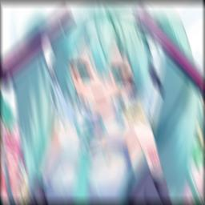

# Modified Pyblur

Modify function of Pyblur, also add StochasticMotionBlur

## Installation

From pip: `pip install git+https://github.com/PD-Mera/pyblur.git`

Or alternatively `git clone` this repo and run locally

``` bash
git clone https://github.com/PD-Mera/pyblur.git
pip install -e pyblur
```

## Usage

### Random Blur
Randomly applies one of the supported blur types, with a randomized bandwidth/strengh.

``` python
from PIL import Image
from pyblur import RandomizedBlur

img = Image.open("test.jpg").convert("RGB")
blurred = RandomizedBlur(img)
blurred.save("test.jpg")
```

or you can modify DEFAULT_BLUR_FUNCTIONS to randomize with your own config

``` python
from PIL import Image
from pyblur import RandomizedBlur, DEFAULT_BLUR_FUNCTIONS

blurFunctions = DEFAULT_BLUR_FUNCTIONS.copy()
blurFunctions["StochasticMotionBlur"]["intensity_min"] = 0.2

img = Image.open("test.jpg").convert("RGB")
blurred = RandomizedBlur(img, blurFunctions)
blurred.save("test.jpg")
```

Using `print(DEFAULT_BLUR_FUNCTIONS)` to see more config

## Example

<details>
  <summary>Click here to view example</summary>

| High Quality |
| :---: |
|  |

| Box Blur | Defocus Blur |
| :---: | :---: |
|  |  |

| Gaussian Blur | Linear Motion Blur |
| :---: | :---: |
|  |  |

| Psf Blur | Stochastic Motion Blur |
| :---: | :---: |
|  |  |

</details>

## Reference

- [lospooky/pyblur](https://github.com/lospooky/pyblur)
- [LeviBorodenko/motionblur](https://github.com/LeviBorodenko/motionblur)